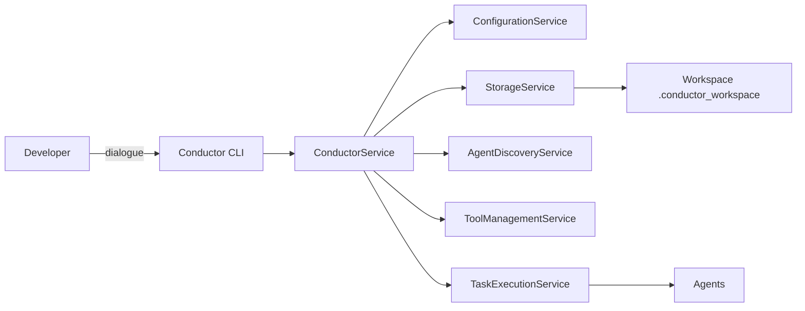

# 🎼 Conductor: The AI-Powered Orchestration Framework

> **Conductor is an AI ecosystem that turns dialogue into production-ready code through interactive and orchestrated agents.**

[](https://python.org)
[](LICENSE)
[]()
[]()

---

## 🚀 Overview

Conductor is a multi-agent framework designed to provide a robust platform for AI-assisted development and automation. It allows you to create, manage, and orchestrate specialized AI agents that can reason, plan, and execute complex coding tasks by interacting with your codebase.


### Related Diagrams
- Detailed CLI view: [cli-overview.md](docs/architecture/sequence-diagrams/cli-overview.md)
- Execution modes: [execution-modes.md](docs/architecture/sequence-diagrams/execution-modes.md)
- REPL flow: [repl-flow.md](docs/architecture/sequence-diagrams/repl-flow.md)
- Parameter impact: [params-impact.md](docs/architecture/sequence-diagrams/params-impact.md)



-   **Orchestrate Complex Workflows:** Define multi-step plans in simple YAML files and let Conductor execute them automatically.
-   **Interact with Specialist Agents:** Dialogue with AI agents that have access to your code, enabling a conversational approach to development.
-   **Multi-Provider Support:** Flexibly switch between different AI providers like Gemini and Claude for each agent.
-   **Safe & Secure:** Agents operate in a secure environment with scoped file system access and human-in-the-loop confirmations for critical operations.

## ✨ Key Features

-   💬 **Interactive Sessions:** Engage in conversations with AI agents to refine ideas and co-create solutions.
-   🤖 **Multi-Provider AI:** Configure different AI models for different agents to leverage the best tool for the job.
-   📂 **Environment-Oriented Architecture:** Safely manage and operate on multiple projects and environments.
-   🛠️ **Scoped Tool System:** Grant agents secure and controlled access to the file system.
-   🧬 **Metaprogramming:** Use agents to create and manage other agents, enabling a self-improving system.
-   📋 **Plan-Based Execution:** Automate complex coding tasks by defining a sequence of steps in a YAML workflow.

### 💡 A Practical Example

**The traditional way:** To add a field to a database entity, you need to:
1.  Write the database migration.
2.  Change the entity class in the code.
3.  Update the DTO (Data Transfer Object).
4.  Expose the new field in the API.
5.  Update the tests.

**With Conductor:** You simply instruct the agent:
> *'''Add a 'last_login' date field to the User entity, including the database migration, DTO, and API endpoint.'''*

Conductor then orchestrates the specialist agents needed to execute all steps automatically.

### 👥 Who is Conductor for?
- **Developers & Agile Teams** who want to accelerate development and automate repetitive coding tasks.
- **DevOps Engineers** looking to automate the configuration and maintenance of infrastructure as code.
- **AI Enthusiasts** who want a robust platform to build and experiment with multi-agent systems.

## 🚀 Getting Started

Conductor provides a unified CLI interface that makes it easy to interact with AI agents for development tasks.

### 1. Configuration

Configure your environment in the `config.yaml` file at the project root:

```yaml
# config.yaml
storage:
  type: filesystem
  path: .conductor_workspace

# Add directories for your custom tools
tool_plugins:
  - custom_tools/
```

-   **storage**: Defines where agent data is stored.
    -   `filesystem`: (Default) Ideal for local development, no dependencies required.
    -   `mongodb`: For team environments or production.
-   **tool_plugins**: List of directories where Conductor will look for custom tools.

### 2. Quick Start

```bash
# List available agents
conductor --list

# Execute a simple task (stateless, fast)
conductor --agent SystemGuide_Meta_Agent --input '''Explain how Conductor works'''

# Contextual conversation (with history)
conductor --agent AgentCreator_Agent --chat --input '''Create a new agent'''
conductor --agent AgentCreator_Agent --chat --input '''Add security features'''

# Interactive session (REPL)
conductor --agent AgentCreator_Agent --chat --interactive

# Install agent templates
conductor --install list
conductor --install web_development

# Storage migration (filesystem ↔ MongoDB)
conductor --migrate-to mongodb --no-config-update  # Safe backup
conductor --migrate-to mongodb                      # Permanent migration
```

### 💾 Storage Migration

Conductor supports bidirectional migration between filesystem and MongoDB:

```bash
# Backup to MongoDB (preserves filesystem config)
conductor --migrate-to mongodb --no-config-update

# Restore from MongoDB  
conductor --migrate-from mongodb --migrate-to filesystem --no-config-update

# External backup (private Git repos)
conductor --migrate-to filesystem --path /path/to/backup
```

Perfect for RAMDisk workflows and team scaling. See [Storage Migration Guide](docs/guides/storage-migration.md) for details.

## 🎯 How to Use Conductor

### 📋 **Basic Commands**

#### **List Available Agents**
```bash
conductor --list
```
Shows all available agents with their capabilities and tags.

#### **Stateless Execution (Fast, No History)**
```bash
# Basic syntax - perfect for automation and quick tasks
conductor --agent <agent_id> --input '''<your_message>'''

# With custom timeout
conductor --agent <agent_id> --input '''<your_message>''' --timeout 300

# JSON output (machine-friendly)
conductor --agent <agent_id> --input '''<your_message>''' --output json

# Practical examples
conductor --agent SystemGuide_Meta_Agent --input '''Explain the system architecture'''
conductor --agent CommitMessage_Agent --input '''Generate commit message for current changes'''
conductor --agent CodeReviewer_Agent --input '''Review this function: def hello(): pass'''
```

#### **Contextual Chat (With History)**
```bash
# Chat with conversation history - perfect for iterative work
conductor --agent <agent_id> --chat --input '''Your message'''

# Continue conversation (preserves context)
conductor --agent <agent_id> --chat --input '''Continue explaining'''

# Clear history and start fresh
conductor --agent <agent_id> --chat --clear --input '''New conversation'''
```

#### **Interactive Sessions (REPL)**
```bash
# Interactive session after initial message
conductor --agent <agent_id> --chat --input '''Start analysis''' --interactive

# Direct REPL (no initial message)
conductor --agent <agent_id> --chat --interactive

# Simulation mode (no real AI calls)
conductor --agent <agent_id> --chat --interactive --simulate
```

#### **Agent Information**
```bash
conductor --info <agent_id>
```
Shows complete information: capabilities, tags, files, statistics, and status.

#### **System Operations**
```bash
# Validate system configuration
conductor --validate

# Backup and restore agents
conductor --backup
conductor --restore
```

### 🎯 Typical Workflow

#### **1. Discover Available Agents**
```bash
conductor --list
```

#### **2. Create a New Agent (if needed)**
```bash
conductor repl --agent AgentCreator_Agent --mode dev
```

#### **3. Use the Created Agent**
```bash
conductor execute --agent NewAgent --input '''Execute your task'''
```

#### **4. Check Agent Information**
```bash
conductor info --agent NewAgent
```

### 🛠️ Practical Examples

#### **Create and Use a Code Review Agent**
```bash
# 1. Create the agent interactively
conductor --agent AgentCreator_Agent --chat --input '''Create a CodeReviewer_Agent for Python code quality analysis''' --interactive
[AgentCreator_Agent]> Add PEP8 checking capabilities
[AgentCreator_Agent]> Include security analysis features
[AgentCreator_Agent]> exit

# 2. Use the created agent (stateless - fast)
conductor --agent CodeReviewer_Agent --input '''Review this code: def example(): pass'''

# 3. Get agent information
conductor --info CodeReviewer_Agent
```

#### **Iterative Development Workflow**
```bash
# Start contextual conversation
conductor --agent AgentCreator_Agent --chat --input '''I need to create a specialized agent'''

# Continue the conversation (remembers context)
conductor --agent AgentCreator_Agent --chat --input '''It should analyze API performance'''

# Add more requirements (still remembers everything)
conductor --agent AgentCreator_Agent --chat --input '''Include monitoring capabilities'''
```

#### **Quick Automation Tasks**
```bash
# Generate commit messages (stateless - perfect for scripts)
conductor --agent CommitMessage_Agent --input '''Generate commit message for: added input validation and fixed authentication bug'''

# Code analysis in CI/CD
conductor --agent SecurityAuditor_Agent --input '''Audit the authentication module''' --timeout 300

# Documentation generation
conductor --agent DocWriter_Agent --input '''Generate API documentation for the user service'''
```

#### **Interactive Development Session**
```bash
# Start interactive session with initial context
conductor --agent AgentCreator_Agent --chat --input '''Let's create a comprehensive testing agent''' --interactive

# Now you're in REPL mode with full context
[AgentCreator_Agent]> What testing frameworks should we support?
[AgentCreator_Agent]> Add unit testing capabilities
[AgentCreator_Agent]> Include integration testing features
[AgentCreator_Agent]> Generate the agent definition
[AgentCreator_Agent]> exit
```

### 🔧 Troubleshooting

#### **Command not found: `conductor`**
```bash
# Use full path
python src/cli/conductor.py --list

# Or make script executable
chmod +x conductor
./conductor --list
```

#### **Agent not found**
```bash
# List available agents
conductor --list

# System automatically suggests similar agents
conductor --agent TestAgent --input '''test'''
# Output: ❌ Agent 'TestAgent' not found
#         💡 Similar agents: TestingSpecialist_Agent, SystemGuide_Meta_Agent
```

#### **Timeout on long operations**
```bash
# If agent takes too long (default timeout: 120s)
conductor --agent MyAgent --input '''complex task''' --timeout 300

# For very complex tasks
conductor --agent MyAgent --chat --input '''complete analysis''' --timeout 600
```

#### **Validate everything is working**
```bash
conductor --validate
```

### 💡 Advanced Tips

- **Cache**: System uses 5-minute cache for agent discovery
- **Suggestions**: When an agent is not found, system suggests similar ones
- **History**: Each agent maintains conversation history when using `--chat` mode
- **Validation**: Use `--validate` to diagnose problems
- **Performance**: Use stateless mode (without `--chat`) for faster execution

#### Scenario 2: Project Analysis
```bash
# 1. Execute analysis agent on a specific project
conductor execute --agent ProjectAnalyst_Agent --environment production --project ecommerce --input '''Analyze the current system architecture'''

# 2. Get detailed information about the agent used
conductor info --agent ProjectAnalyst_Agent
```

#### Scenario 3: Working with Documentation
```bash
# Execute agent to analyze documentation
conductor execute --agent DocumentAnalyst_Agent --input '''Analyze all README files in the project and generate a summary'''
```

### 🔄 Agent Management

#### **Install Agent Templates**
```bash
# List available templates
conductor --install list

# Install specific category
conductor --install web_development

# Install specific agent
conductor --install ReactExpert_Agent
```

#### **Backup and Restore**
```bash
# Backup all agents
conductor --backup

# Restore agents from backup
conductor --restore
```

### 🔨 How to Create New Agents

#### Method 1: Using AgentCreator_Agent (Recommended)
```bash
# Interactive agent creation
conductor repl --agent AgentCreator_Agent --mode dev
[AgentCreator_Agent]> Create an agent for database performance analysis with capabilities: query_analysis, index_optimization, performance_monitoring
[AgentCreator_Agent]> exit
```

#### Method 2: Manual Creation
```bash
# 1. Create agent directory
mkdir -p .conductor_workspace/agents/MyNewAgent_Agent

# 2. Create definition file
cat > .conductor_workspace/agents/MyNewAgent_Agent/definition.yaml << 'EOF'
name: '''My New Agent'''
version: '''1.0.0'''
author: '''Your Name'''
description: '''Description of what the agent does'''
capabilities:
  - capability1
  - capability2
tags:
  - tag1
  - tag2
allowed_tools:
  - file_operations
  - web_search
EOF

# 3. Create persona file
cat > .conductor_workspace/agents/MyNewAgent_Agent/persona.md << 'EOF'
# Persona: Your Agent

## Description
Detailed description of agent behavior and specialization.

## Instructions
- Instruction 1
- Instruction 2
- Instruction 3
EOF

# 4. Verify agent was created correctly
conductor info --agent MyNewAgent_Agent
```

### 🚨 Basic Troubleshooting

#### Problem: Agent not found
```bash
# ❌ Error: Agent 'MyAgent' not found
conductor execute --agent MyAgent --input '''test'''

# ✅ Solution: List available agents
conductor --list

# ✅ Or get similar suggestions
conductor info --agent MyAgent
```

#### Problem: Configuration error
```bash
# ✅ Always validate configuration first
conductor --validate

# If there are problems, check:
# 1. If the config.yaml file exists
# 2. If the .conductor_workspace directory has correct permissions
# 3. If the agents have valid definition.yaml files
```

#### Problem: File Permissions
```bash
# ✅ Ensure the conductor executable has permissions
chmod +x conductor

# ✅ Check workspace permissions
ls -la .conductor_workspace/
```

#### Problem: Python Dependencies
```bash
# ✅ Install dependencies
poetry install

# ✅ Activate virtual environment
poetry shell

# ✅ Run with poetry
poetry run python src/cli/conductor.py --list
```

#### Problem: Agent doesn't respond or fails
```bash
# ✅ Check detailed logs (if available)
conductor execute --agent ProblematicAgent --input '''test''' --timeout 300

# ✅ Check agent structure
conductor info --agent ProblematicAgent

# ✅ Validate agent definition manually
cat .conductor_workspace/agents/ProblematicAgent/definition.yaml
```

### 💡 Advanced Tips

#### 1. **Using Environment Variables**
```bash
# Configure variables for different environments
export CONDUCTOR_ENV=development
conductor execute --agent MyAgent --input '''Analyze the $CONDUCTOR_ENV environment'''
```

#### 2. **Piping and Automation**
```bash
# Chain commands
conductor --list | grep '''Analyst''' | head -5

# Use in bash scripts
#!/bin/bash
for agent in $(conductor --list | grep '''Agent''' | awk '{print $2}'); do
    echo '''Checking $agent...'''
    conductor info --agent '''$agent'''
done
```

#### 3. **Flexible Project Context**
```bash
# Use variables for dynamic projects
PROJECT=$(basename $(pwd))
conductor execute --agent ProjectAnalyst_Agent --project '''$PROJECT''' --input '''Analyze this project'''
```

### 📊 Quick Reference Commands

| Command | Description | Example |
|---------|-------------|---------|
| `--list` | List all agents | `conductor --list` |
| `--agent --input` | Stateless execution | `conductor --agent MyAgent --input '''text'''` |
| `--agent --chat --input` | Contextual chat | `conductor --agent MyAgent --chat --input '''text'''` |
| `--agent --chat --interactive` | Interactive REPL | `conductor --agent MyAgent --chat --interactive` |
| `--info` | Show agent details | `conductor --info MyAgent` |
| `--validate` | Validate configuration | `conductor --validate` |
| `--install` | Install templates | `conductor --install web_development` |
| `--backup` | Backup agents | `conductor --backup` |
| `--output json` | JSON output | `conductor --agent MyAgent --input '''text''' --output json` |

### 🎯 **When to Use Each Mode**

| Mode | Use Case | Example |
|------|----------|---------|
| **Stateless** (`--input`) | Quick tasks, automation, CI/CD | `conductor --agent CodeReviewer --input '''review code'''` |
| **Contextual** (`--chat --input`) | Iterative work, related questions | `conductor --agent AgentCreator --chat --input '''continue building'''` |
| **Interactive** (`--chat --interactive`) | Development, experimentation | `conductor --agent AgentCreator --chat --interactive` |

## 📚 Documentation

-   **[Full Documentation](docs/README.md):** Dive deeper into Conductor's architecture, features, and guides.
-   **[Configuration Guide](docs/guides/configuration.md):** Learn how to configure workspaces, AI providers, and workflows.
-   **[Agent Design Patterns](docs/guides/AGENT_DESIGN_PATTERNS.md):** Best practices for creating effective agents.

## ❤️ Support Conductor

Conductor is an open-source project driven by passion and innovation. Your support helps us maintain the project, develop new features, improve documentation, and grow our community.

### Ways to Support:

-   **Become a GitHub Sponsor:** Support us with recurring contributions directly through GitHub.
    [](https://github.com/sponsors/cezarfuhr)
    *(You'll need to set up GitHub Sponsors on your profile.)*
-   **Buy Me a Coffee:** Make a one-time or recurring donation to support our work.
    [](https://buymeacoffee.com/cezarfuhr)
-   **Direct Contributions:** For larger contributions or corporate partnerships, please reach out via our [Consulting & Advisory Services](project-management/CONSULTING.md) page.
-   **Spread the Word:** Star our repository, share it with your network, and use Conductor in your projects!

Thank you for being a part of our journey!

## 🤝 Contributing

We welcome contributions from the community! Please read our **[Contributing Guide](CONTRIBUTING.md)** to learn how you can get involved.

Also, be sure to review our **[Code of Conduct](CODE_OF_CONDUCT.md)** to understand our community standards.

---

**🎼 Conductor** - Orchestrating dialogue, transforming ideas into code.