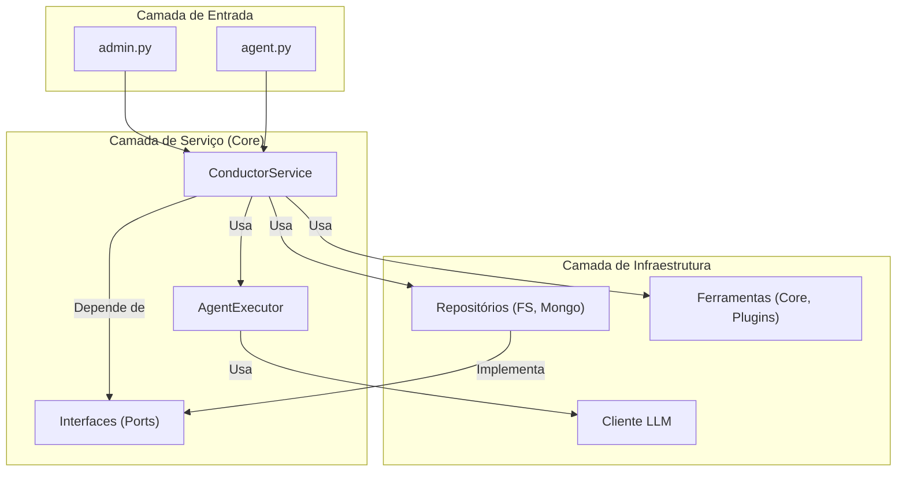
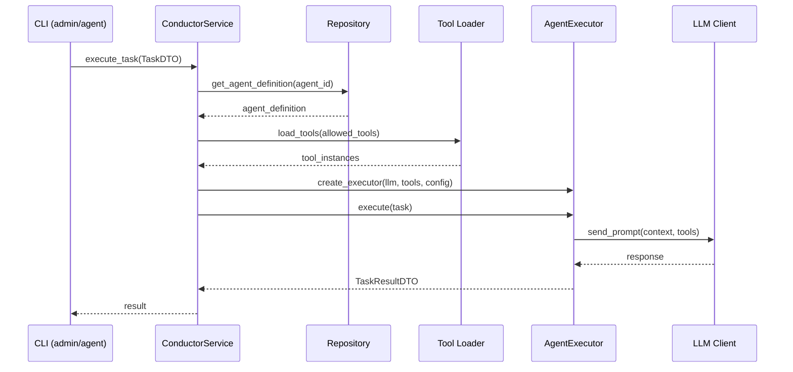

# A Arquitetura Unificada do Conductor (Pós-SAGA-017)

## 1. Visão Geral

A arquitetura do Conductor evoluiu para um modelo desacoplado e orientado a serviços. O objetivo é separar claramente as responsabilidades, permitindo extensibilidade, testabilidade e escalabilidade. A filosofia central é a Inversão de Dependência, onde os componentes de alto nível não dependem dos detalhes dos componentes de baixo nível.

## 2. Componentes Principais

A arquitetura é dividida em três camadas lógicas principais:

-   **Camada de Entrada (Interface):** Pontos de entrada do usuário.
-   **Camada de Serviço (Core):** O cérebro da aplicação.
-   **Camada de Infraestrutura:** Implementações concretas de dependências externas.

### Diagrama de Componentes

## 3. Fluxo de Execução de uma Tarefa

1.  Um **CLI** (`admin.py` ou `agent.py`) recebe um comando do usuário.
2.  Ele traduz os argumentos em um `TaskDTO` e chama `execute_task` no **ConductorService**.
3.  O **ConductorService** consulta o **Repositório** para obter a definição do agente.
4.  Ele carrega as **Ferramentas** permitidas.
5.  Ele instancia um **AgentExecutor**, injetando o cliente **LLM**, as ferramentas e outras dependências.
6.  O **AgentExecutor** executa a tarefa, interagindo com o **LLM**.
7.  O resultado é retornado como um `TaskResultDTO` através das camadas.

### Diagrama de Fluxo de Execução

## 4. Detalhamento dos Componentes

### 4.1 ConductorService

O `ConductorService` é o ponto central de coordenação da aplicação. Suas responsabilidades incluem:

- Orquestração de tarefas
- Gerenciamento de configurações
- Instanciação de executores
- Integração com repositórios e ferramentas

### 4.2 AgentExecutor

O `AgentExecutor` é responsável pela execução efetiva das tarefas usando LLMs. Características principais:

- Interface agnóstica a provedores de LLM
- Gerenciamento de contexto de execução
- Integração com ferramentas disponíveis
- Tratamento de erros e timeouts

### 4.3 Ports (Interfaces)

As interfaces em `ports/` definem contratos abstratos para:

- Repositórios de dados
- Clientes LLM
- Sistemas de armazenamento
- Ferramentas externas

### 4.4 Configuração via config.yaml

O sistema de configuração centralizada permite:

- Definição de agentes e suas capacidades
- Configuração de provedores de LLM
- Especificação de ferramentas permitidas
- Parametrização de comportamentos do sistema

## 5. Princípios Arquitetônicos

### 5.1 Inversão de Dependência

Componentes de alto nível não dependem de implementações concretas, mas de abstrações definidas em `ports/`.

### 5.2 Separação de Responsabilidades

Cada componente tem uma responsabilidade bem definida e limitada.

### 5.3 Testabilidade

A arquitetura permite testes unitários e de integração através de mocks e stubs das interfaces.

### 5.4 Extensibilidade

Novos provedores de LLM, ferramentas e repositórios podem ser adicionados sem modificar o core da aplicação.

## 6. Migração e Compatibilidade

Esta arquitetura representa a evolução pós-SAGA-017, mantendo compatibilidade com interfaces existentes enquanto deprecia componentes legados como `agent_logic.py` e `workspaces.yaml`.