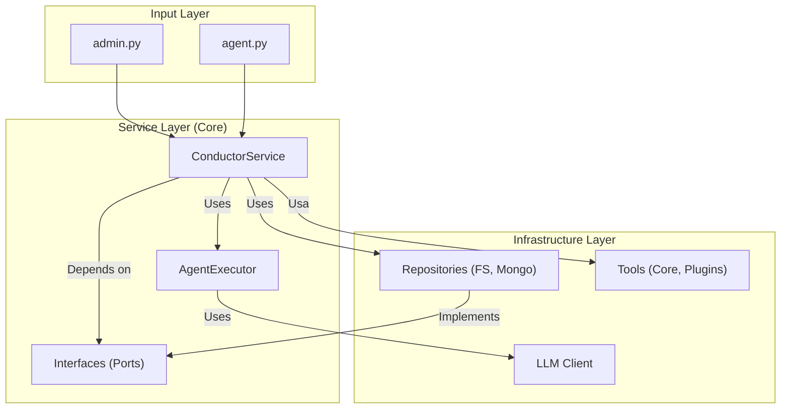
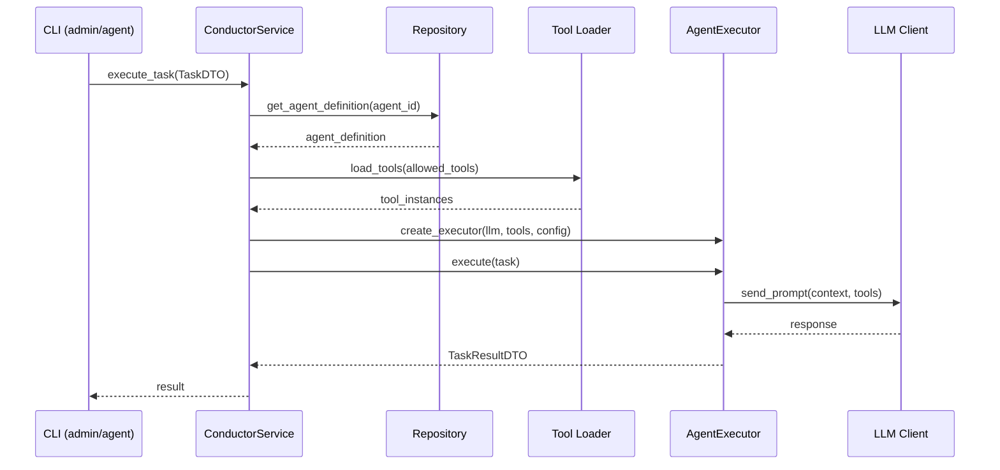

# The Unified Architecture of Conductor (Post-SAGA-017)

## 1. Overview

The architecture of Conductor has evolved into a decoupled, service-oriented model. The goal is to clearly separate responsibilities, allowing for extensibility, testability, and scalability. The core philosophy is Dependency Inversion, where high-level components do not depend on the details of low-level components.

## 2. Main Components

The architecture is divided into three main logical layers:

-   **Input Layer (Interface):** User entry points.
-   **Service Layer (Core):** The application's brain.
-   **Infrastructure Layer:** Concrete implementations of external dependencies.

### Component Diagram

## 3. Task Execution Flow

1.  A **CLI** (`admin.py` or `agent.py`) receives a command from the user.
2.  It translates the arguments into a `TaskDTO` and calls `execute_task` on the **ConductorService**.
3.  The **ConductorService** queries the **Repository** to get the agent's definition.
4.  It loads the allowed **Tools**.
5.  It instantiates an **AgentExecutor**, injecting the **LLM** client, tools, and other dependencies.
6.  The **AgentExecutor** executes the task, interacting with the **LLM**.
7.  The result is returned as a `TaskResultDTO` through the layers.

### Execution Flow Diagram

## 4. Component Details

### 4.1 ConductorService

The `ConductorService` is the central coordination point of the application. Its responsibilities include:

- Task orchestration
- Configuration management
- Executor instantiation
- Integration with repositories and tools

### 4.2 AgentExecutor

The `AgentExecutor` is responsible for the effective execution of tasks using LLMs. Main features:

- LLM provider-agnostic interface
- Execution context management
- Integration with available tools
- Error and timeout handling

### 4.3 Ports (Interfaces)

The interfaces in `ports/` define abstract contracts for:

- Data repositories
- LLM clients
- Storage systems
- External tools

### 4.4 Configuration via config.yaml

The centralized configuration system allows for:

- Definition of agents and their capabilities
- Configuration of LLM providers
- Specification of allowed tools
- Parameterization of system behaviors

## 5. Architectural Principles

### 5.1 Dependency Inversion

High-level components do not depend on concrete implementations, but on abstractions defined in `ports/`.

### 5.2 Separation of Responsibilities

Each component has a well-defined and limited responsibility.

### 5.3 Testability

The architecture allows for unit and integration tests through mocks and stubs of the interfaces.

### 5.4 Extensibility

New LLM providers, tools, and repositories can be added without modifying the application's core.

## 6. Migration and Compatibility

This architecture represents the evolution post-SAGA-017, maintaining compatibility with existing interfaces. The configuration is now centralized in `config.yaml` at the project root.