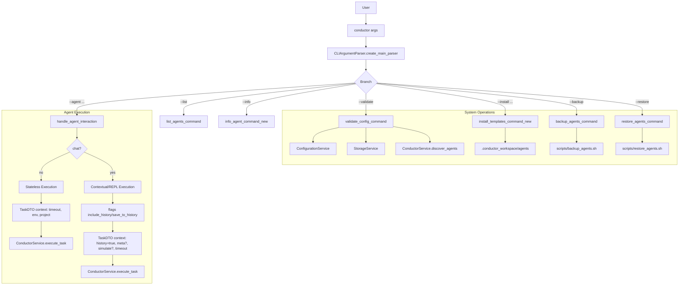

# 🧭 Conductor CLI - Overview

> Maps the main flow of `conductor` from `src/cli/conductor.py` and the scope described in `README.md`.

## 🔀 Input Flow and Command Routing

## 🧩 Main Components
- **ConductorCLI**: Orchestrates the command-line experience and builds `TaskDTO`.
- **ConductorService**: A facade that delegates to specialized services.
- **Configuration/Storage/AgentDiscovery/ToolManagement/TaskExecution**: Internal services used by `ConductorService`.

## 📌 Notes
- When `--chat` is used, the flow enables history (include/save) and can enter REPL (`--interactive`).
- `--simulate` in REPL/Chat can short-circuit in `ConductorCLI.chat()` or be propagated in the task's `context`.