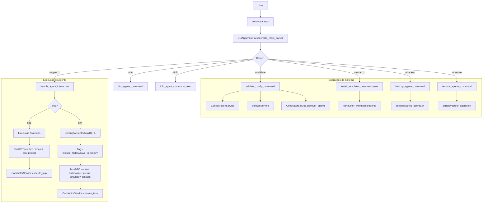

# 🧭 Conductor CLI - Visão Geral (Overview)

> Mapeia o fluxo principal do `conductor` a partir do `src/cli/conductor.py` e do escopo descrito no `README.md`.

## 🔀 Fluxo de Entrada e Roteamento de Comandos

## 🧩 Componentes Principais
- **ConductorCLI**: Orquestra a experiência de linha de comando e constrói `TaskDTO`.
- **ConductorService**: Fachada que delega para serviços especializados.
- **Configuration/Storage/AgentDiscovery/ToolManagement/TaskExecution**: Serviços internos usados pelo `ConductorService`.

## 📌 Notas
- Quando `--chat` é usado, o fluxo habilita histórico (include/save) e pode entrar em REPL (`--interactive`).
- `--simulate` no REPL/Chat pode short-circuit no `ConductorCLI.chat()` ou ser propagado no `context` da tarefa.
