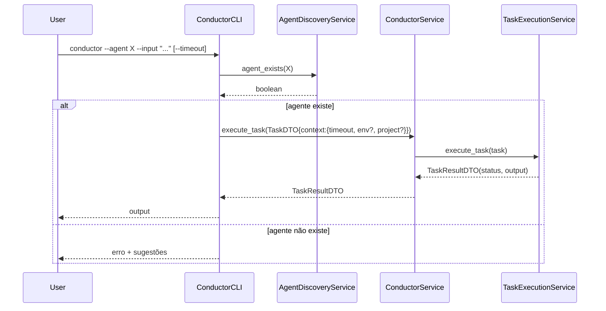
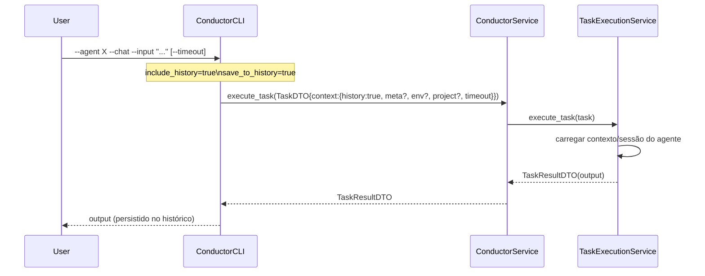
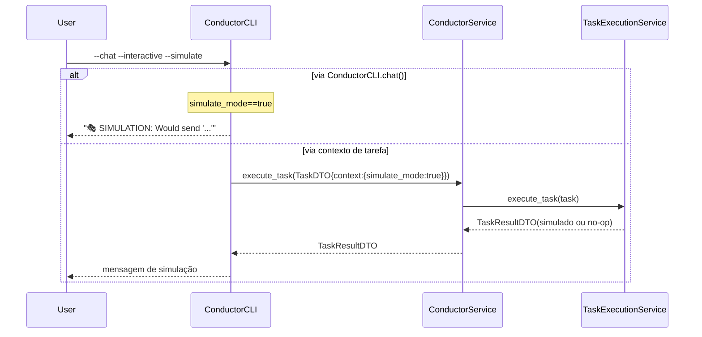

# ⚙️ Modos de Execução do Conductor

> Diagramas de sequência para: Stateless, Chat (com histórico) e Simulação.

## 1) Execução Stateless (rápida, sem histórico)

## 2) Chat Contextual (com histórico)

## 3) Simulação (sem chamada real à IA)

## 📝 Observações
- `--timeout` sempre é propagado em `TaskDTO.context` e pode influenciar o executor de tarefas.
- `--meta` e `--new-agent-id` ajustam o contexto e a construção de prompt quando aplicável.
