# ⚙️ Conductor Execution Modes

> Sequence diagrams for: Stateless, Chat (with history), and Simulation.

## 1) Stateless Execution (fast, no history)


## 2) Contextual Chat (with history)

```mermaid
sequenceDiagram
    participant User
    participant ConductorCLI
    participant Conductor as ConductorService
    participant TaskExec as TaskExecutionService

    User->>ConductorCLI: --agent X --chat --input "..." [--timeout]
    Note over ConductorCLI: include_history=true
save_to_history=true
    ConductorCLI->>Conductor: execute_task(TaskDTO{context:{history:true, meta?, env?, project?, timeout}})
    Conductor->>TaskExec: execute_task(task)
    TaskExec->>TaskExec: load agent context/session
    TaskExec-->>Conductor: TaskResultDTO(output)
    Conductor-->>ConductorCLI: TaskResultDTO
    ConductorCLI-->>User: output (persisted in history)
```

## 3) Simulation (no real AI call)

```mermaid
sequenceDiagram
    participant User
    participant ConductorCLI
    participant Conductor as ConductorService
    participant TaskExec as TaskExecutionService

    User->>ConductorCLI: --chat --interactive --simulate
    alt via ConductorCLI.chat()
        Note over ConductorCLI: simulate_mode==true
        ConductorCLI-->>User: "🎭 SIMULATION: Would send '...'")
    else via task context
        ConductorCLI->>Conductor: execute_task(TaskDTO{context:{simulate_mode:true}})
        Conductor->>TaskExec: execute_task(task)
        TaskExec-->>Conductor: TaskResultDTO(simulated or no-op)
        Conductor-->>ConductorCLI: TaskResultDTO
        ConductorCLI-->>User: simulation message
    end
```



## 📝 Notes
- `--timeout` is always propagated in `TaskDTO.context` and can influence the task executor.
- `--meta` and `--new-agent-id` adjust the context and prompt construction when applicable.