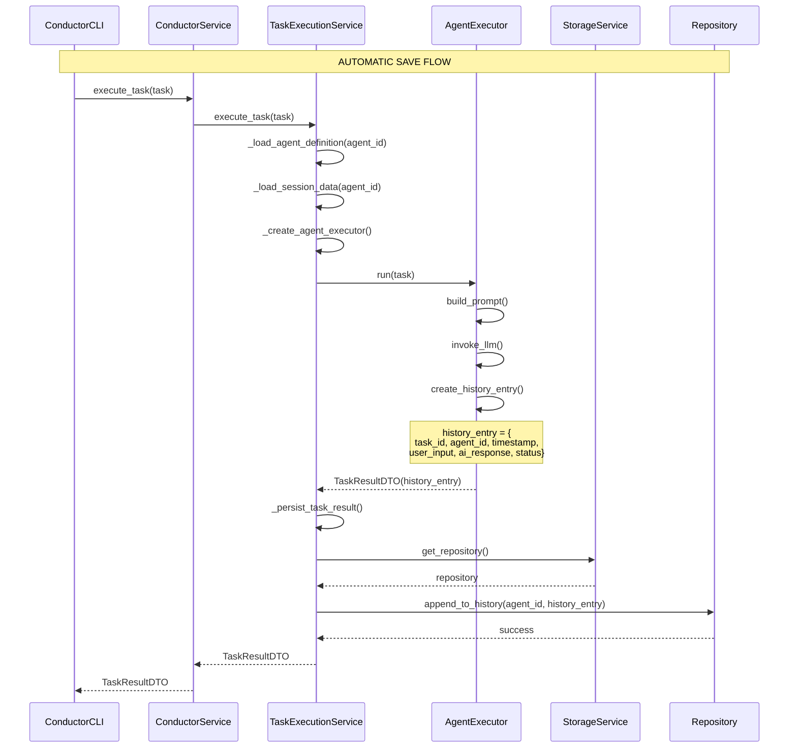
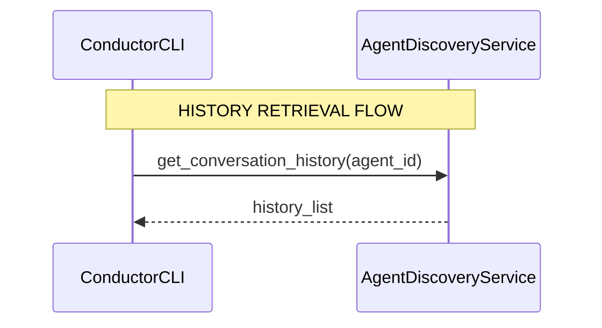
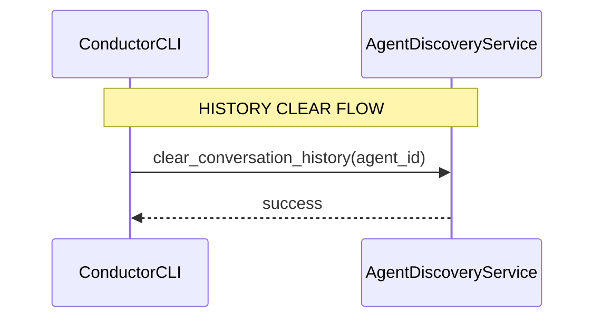

# 📊 History Management - Sequence Diagrams

> **Purpose:** Document the communication flows for history save, load, and clear operations in the Conductor framework.

## 🔄 History Save Flow (Automatic)

This flow shows how conversation history is automatically saved after each task execution.

## 📖 History Load Flow (REPL/CLI)

This flow shows how conversation history is retrieved when the user asks to view history.

## 🗑️ History Clear Flow (CLI)

This flow shows how conversation history is cleared when the user requests a clear.

## 🔍 Key Points

### 1. **Automatic Save:**
- **AgentExecutor** creates `history_entry`
- **TaskExecutionService** persists via repository (`append_to_history`)

### 2. **Manual Load/Clear via CLI:**
- **ConductorCLI** uses `AgentDiscoveryService.get_conversation_history/clear_conversation_history`
- No direct exposure of the `repository` by the `ConductorService`

## 🎯 Architecture Notes

The flow has been updated to reflect the current API of the `ConductorCLI` and internal services. If low-level access to the repository is needed by the CLI, consider adding dedicated methods in the `ConductorService` instead of exposing the `repository` directly.