# 📊 History Management - Sequence Diagrams

> **Purpose:** Document the communication flows for history save, load, and clear operations in the Conductor framework.

## 🔄 History Save Flow (Automatic)

This flow shows how conversation history is automatically saved after each task execution.

```mermaid
sequenceDiagram
    participant AdminCLI
    participant ConductorService
    participant TaskExecutionService
    participant AgentExecutor
    participant StorageService
    participant Repository

    Note over AdminCLI,Repository: FLUXO DE SALVAMENTO AUTOMÁTICO

    AdminCLI->>ConductorService: execute_task(task)
    ConductorService->>TaskExecutionService: execute_task(task)
    
    TaskExecutionService->>TaskExecutionService: _load_agent_definition(agent_id)
    TaskExecutionService->>TaskExecutionService: _load_session_data(agent_id)
    TaskExecutionService->>TaskExecutionService: _create_agent_executor()
    
    TaskExecutionService->>AgentExecutor: run(task)
    AgentExecutor->>AgentExecutor: build_prompt()
    AgentExecutor->>AgentExecutor: invoke_llm()
    AgentExecutor->>AgentExecutor: create_history_entry()
    
    Note over AgentExecutor: history_entry = {<br/>task_id, agent_id, timestamp,<br/>user_input, ai_response, status}
    
    AgentExecutor-->>TaskExecutionService: TaskResultDTO(history_entry)
    
    TaskExecutionService->>TaskExecutionService: _persist_task_result()
    TaskExecutionService->>StorageService: get_repository()
    StorageService-->>TaskExecutionService: repository
    TaskExecutionService->>Repository: append_to_history(agent_id, history_entry)
    Repository-->>TaskExecutionService: success
    
    TaskExecutionService-->>ConductorService: TaskResultDTO
    ConductorService-->>AdminCLI: TaskResultDTO
```

## 📖 History Load Flow (Command: history)

This flow shows how conversation history is retrieved when the user types the `history` command.

```mermaid
sequenceDiagram
    participant AdminCLI
    participant ConductorService
    participant StorageService
    participant Repository

    Note over AdminCLI,Repository: FLUXO DE RECUPERAÇÃO (COMANDO HISTORY)

    AdminCLI->>ConductorService: repository.load_history(agent_id)
    ConductorService->>StorageService: get_repository()
    StorageService-->>ConductorService: repository
    ConductorService->>Repository: load_history(agent_id)
    Repository-->>ConductorService: history_list
    ConductorService-->>AdminCLI: history_list
```

## 🗑️ History Clear Flow (Command: clear)

This flow shows how conversation history is cleared when the user types the `clear` command.

## 🔍 Key Points

### 1. **Automatic Save:**
- **AgentExecutor** creates `history_entry`
- **TaskExecutionService** persists via `_storage.append_to_history()`
- **AdminCLI** doesn't need to do anything

### 2. **Manual Load:**
- **AdminCLI** → `conductor_service.repository.load_history()`
- **ConductorService** delegates to `StorageService.get_repository()`

### 3. **Manual Clear:**
- **AdminCLI** → `conductor_service.repository.clear_history()`
- **ConductorService** delegates to repository

### 4. **Current Issue:**
- **ConductorService** doesn't expose `repository` directly
- **AdminCLI** breaks encapsulation

## 🎯 Architecture Notes

The flow is correct, but the ConductorService needs to expose the `repository` property for AdminCLI to access history management functions.

**Solution:** Add `@property def repository(self):` to ConductorService for backward compatibility.
