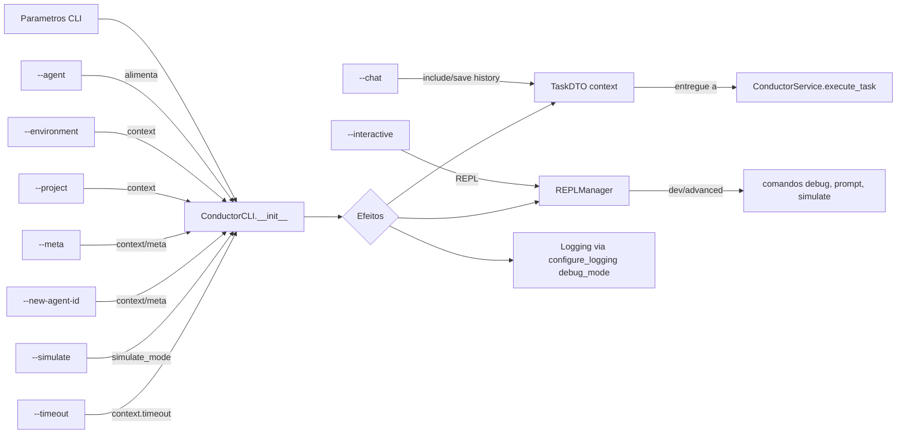

# 🧩 Parâmetros do ConductorCLI e Seus Efeitos

> Referência rápida do impacto dos parâmetros do `ConductorCLI` nos fluxos de execução.

## Mapa de Impacto (Mermaid)

## Tabela de Parâmetros e Efeitos

| Parâmetro | Onde atua | Efeito principal |
|---|---|---|
| `--agent <id>` | `ConductorCLI.embodied`, `AgentDiscoveryService` | Seleciona agente, valida existência e definição |
| `--environment` | `TaskDTO.context.environment` | Contexto de ambiente para o executor |
| `--project` | `TaskDTO.context.project` | Contexto de projeto para o executor |
| `--meta` | `TaskDTO.context.meta` | Habilita comportamento de meta-agente e prompt especial |
| `--new-agent-id` | `TaskDTO.context.new_agent_id` | Usado quando `meta=true` para criação/alteração de agente |
| `--simulate` | `ConductorCLI.simulate_mode` e `TaskDTO.context.simulate_mode` | Simula resposta (short-circuit no chat ou via executor) |
| `--timeout` | `TaskDTO.context.timeout` | Teto de tempo para execução/integração com provider |
| `--chat` | Flags internas `include_history`/`save_to_history` | Ativa histórico e permite REPL/Chat |
| `--interactive` | `REPLManager.start_session` | Inicia REPL com proteções e comandos |
| `--debug mode` (implícito em `repl --mode dev`) | `configure_logging(debug_mode)` | Aumenta verbosidade de logs |

## Observações
- O histórico é exibido/limpo via `ConductorCLI.get/clear_conversation_history()` e persistido pelo executor.
- `get_full_prompt()` usa `meta`/`new_agent_id` para construir o prompt completo quando suportado pelo agente.
