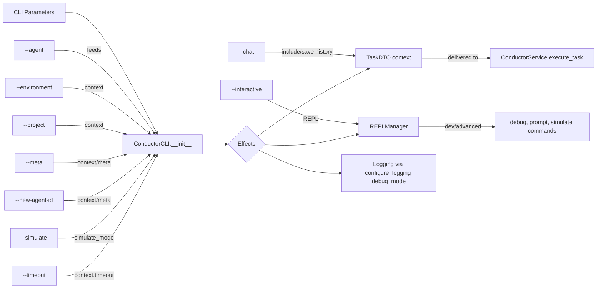

# 🧩 ConductorCLI Parameters and Their Effects

> Quick reference for the impact of `ConductorCLI` parameters on execution flows.

## Impact Map (Mermaid)

## Parameter and Effect Table

| Parameter | Where it acts | Main effect |
|---|---|---|
| `--agent <id>` | `ConductorCLI.embodied`, `AgentDiscoveryService` | Selects agent, validates existence and definition |
| `--environment` | `TaskDTO.context.environment` | Environment context for the executor |
| `--project` | `TaskDTO.context.project` | Project context for the executor |
| `--meta` | `TaskDTO.context.meta` | Enables meta-agent behavior and special prompt |
| `--new-agent-id` | `TaskDTO.context.new_agent_id` | Used when `meta=true` for agent creation/modification |
| `--simulate` | `ConductorCLI.simulate_mode` and `TaskDTO.context.simulate_mode` | Simulates response (short-circuit in chat or via executor) |
| `--timeout` | `TaskDTO.context.timeout` | Time limit for execution/integration with provider |
| `--chat` | Internal flags `include_history`/`save_to_history` | Activates history and allows REPL/Chat |
| `--interactive` | `REPLManager.start_session` | Starts REPL with protections and commands |
| `--debug mode` (implicit in `repl --mode dev`) | `configure_logging(debug_mode)` | Increases log verbosity |

## Notes
- History is displayed/cleared via `ConductorCLI.get/clear_conversation_history()` and persisted by the executor.
- `get_full_prompt()` uses `meta`/`new_agent_id` to build the full prompt when supported by the agent.