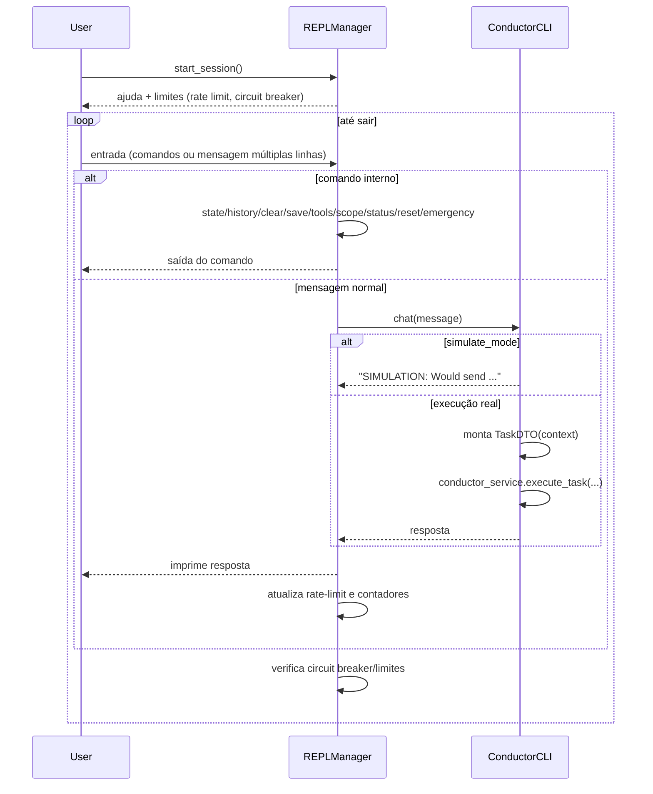

# 🎮 Fluxo do REPL (REPLManager)

> Baseado em `src/cli/shared/repl_manager.py` e integração com `ConductorCLI`.

## Sequência de Interação no REPL

## Comandos Extras por Modo
- **advanced/dev**: adiciona `debug`, `prompt`.
- **dev**: adiciona `simulate`, `export-debug`.

## Proteções
- **Rate limit**: intervalo mínimo entre interações.
- **Circuit breaker**: bloqueio após N erros consecutivos com reset temporizado.
- **Emergency stop**: interrupção imediata da sessão.
