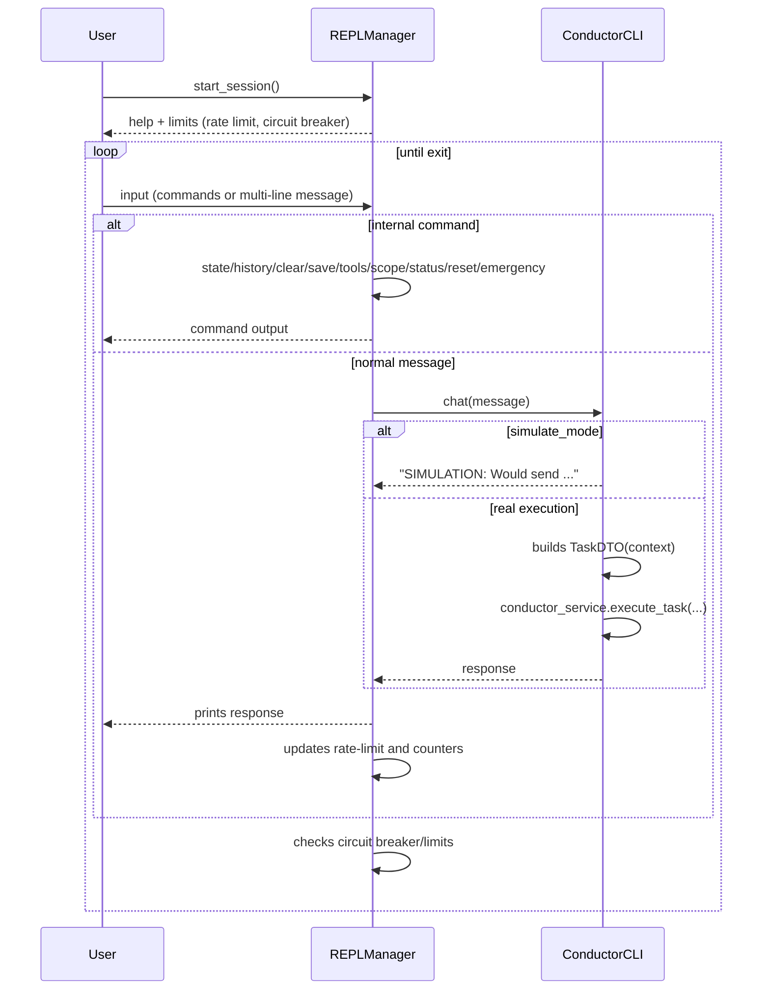

# 🎮 REPL Flow (REPLManager)

> Based on `src/cli/shared/repl_manager.py` and integration with `ConductorCLI`.

## REPL Interaction Sequence

## Extra Commands by Mode
- **advanced/dev**: adds `debug`, `prompt`.
- **dev**: adds `simulate`, `export-debug`.

## Protections
- **Rate limit**: minimum interval between interactions.
- **Circuit breaker**: blocks after N consecutive errors with a timed reset.
- **Emergency stop**: immediate session interruption.