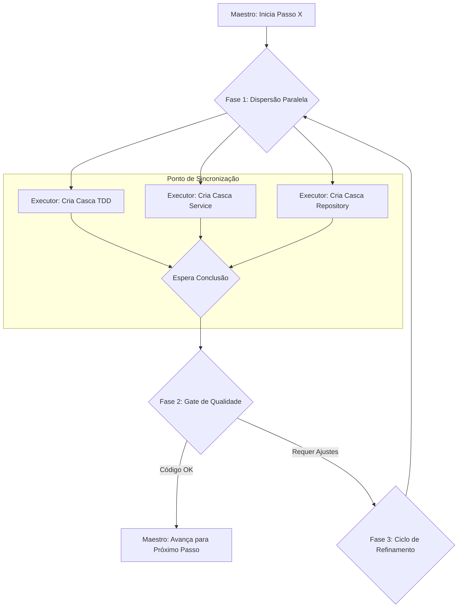

# Arquitetura de Evolução de Agentes e Execução em Larga Escala

**Status:** Em Design

## 1. Visão Geral

Este documento descreve uma arquitetura de sistema de agentes com foco duplo, projetada para ser simultaneamente robusta, previsível e adaptativa. Ela combina uma orquestração **Macro (Top-Down)** para a execução controlada de planos com um mecanismo de evolução **Micro (Bottom-Up)** para a melhoria contínua e auto-organização dos agentes.

O objetivo é criar um sistema que não apenas executa tarefas de forma confiável, mas que aprende e otimiza seu próprio desempenho ao longo do tempo, inspirado por conceitos de Teoria dos Jogos, biologia de enxames e teoria econômica.

## 2. Orquestração Macro: O Modelo Top-Down

A espinha dorsal do sistema é um fluxo de trabalho hierárquico e previsível, garantindo que os objetivos de alto nível sejam alcançados de forma controlada.

### 2.1. A Hierarquia de Agentes

O sistema opera em três níveis de abstração:

1.  **Nível 1: O Planejador Estratégico (Arquiteto):** Em diálogo com um humano, este agente explora um problema, refina o escopo e produz um **Plano Mestre** de alto nível.
2.  **Nível 2: O Maestro (Gerente de Projeto Tático):** Este agente recebe o Plano Mestre e o fragmenta em um **Playbook** de passos de execução atômicos e sequenciais. Ele gerencia o fluxo, valida a qualidade de cada passo e orquestra os agentes do nível inferior.
3.  **Nível 3: O Pool de Executores Especializados:** Um conjunto de agentes que realizam tarefas específicas. Eles compartilham uma base de "Executor" comum, mas são altamente especializados através de `personas` distintas (ex: `Executor(persona=TDD_Writer)`, `Executor(persona=Kotlin_Coder)`).

### 2.2. Execução Paralela em Fases

Para otimizar a velocidade, o Maestro emprega um padrão de "Dispersão Paralela com Gate de Sincronização" para cada passo do playbook.

1.  **Dispersão Paralela:** O Maestro identifica tarefas independentes dentro de um passo (ex: criar esqueletos de arquivos) e as atribui a múltiplos executores simultaneamente.
2.  **Ponto de Sincronização:** O Maestro aguarda que todos os executores da fase atual completem suas tarefas.
3.  **Gate de Qualidade:** O Maestro realiza um code review no trabalho consolidado, decidindo se avança para o próximo passo ou se inicia um novo ciclo de refinamento para corrigir problemas.

## 3. Evolução e Coordenação Micro: Os Modelos Bottom-Up

Enquanto o Maestro gerencia o "o quê", os modelos a seguir governam o "como" e a evolução da eficiência dos agentes executores.

### 3.1. Modelo A: Mercado de Sinais de Confiança

Um modelo de coordenação baseado em princípios econômicos.

*   **Moeda Interna:** Cada agente possui um saldo de **"Confiança"**.
*   **Investimento:** Para agir, um agente "paga" um custo em Confiança, proporcional ao risco/impacto da tarefa.
*   **Payoff:** Se a ação for bem-sucedida (validada por testes, etc.), o agente recebe o investimento de volta mais um "lucro". Se falhar, perde o investimento.
*   **Comportamento Emergente:** Agentes com histórico de sucesso acumulam Confiança e podem arcar com tarefas mais arriscadas e de maior impacto. Agentes que falham são naturalmente marginalizados para tarefas de baixo custo até que recuperem sua reputação. A prioridade é definida pela competência comprovada, não por um gerente central.

### 3.2. Modelo B: Orquestração por Feromônios Digitais

Um modelo de coordenação inspirado na inteligência de enxames.

*   **Ambiente Compartilhado:** Os agentes interagem com um "quadro de avisos" global, depositando e lendo "feromônios" (sinais/metadados).
*   **Deixando Sinais:** Um agente que corrige um bug deixa um sinal `BUG_FIXED`. Um agente de teste que falha deixa um sinal `TEST_FAILED`.
*   **Reagindo a Sinais:** As regras de ativação de um agente dependem dos sinais presentes. Um "Agente de Commit" só age se vir um sinal `TEST_PASSED` e nenhum `TEST_FAILED`.
*   **Comportamento Emergente:** Workflows eficientes emergem como "trilhas de feromônios" reforçadas. Sinais de falha agem como repelentes naturais, bloqueando o progresso até que sejam resolvidos. A coordenação é totalmente indireta e descentralizada.

## 4. Padrões de Implementação para Escalabilidade

Para tornar os modelos acima práticos e eficientes, os seguintes padrões de implementação são cruciais.

### 4.1. O Agente de Duas Camadas (Padrão Gatilho e Raciocínio)

Resolve o problema de custo e eficiência de invocar LLMs desnecessariamente. Cada agente é dividido em:

*   **Camada 1 (Gatilho):** Um script leve, rápido e sem IA que verifica as condições de ativação a cada ciclo (ex: "O saldo de Confiança é suficiente?" ou "Os feromônios corretos estão presentes?").
*   **Camada 2 (Raciocinador):** O agente completo com LLM, que só é ativado se o Gatilho retornar "SIM". Isso garante que o poder de fogo caro da IA seja usado apenas quando há trabalho relevante a ser feito.

### 4.2. Workspaces Efêmeros por Contêiner

Garante o isolamento total para a execução de planos paralelos. 

*   **Fluxo:** Para cada plano, um novo contêiner Docker é iniciado. A primeira etapa é um `git clone` do projeto, criando um workspace totalmente isolado. O trabalho é executado dentro do contêiner e, ao final, um `git push` sincroniza o resultado. O contêiner é então destruído.
*   **Benefício:** Elimina qualquer possibilidade de interferência entre planos concorrentes.

### 4.3. Abstração de Persistência (Pluggable State Repository)

Atende à dupla necessidade de simplicidade para desenvolvimento e robustez para escala.

*   **O Contrato:** O sistema opera contra uma interface `IStateRepository`.
*   **As Implementações:**
    1.  **`FileSystemStateRepository`:** A implementação padrão. Salva o estado em arquivos `.json` locais. Ideal para desenvolvimento e testes, pois não requer dependências externas.
    2.  **`MongoStateRepository`:** Uma implementação alternativa que salva o estado em um banco de dados externo. Essencial para o modelo de contêineres efêmeros, garantindo que o estado do plano sobreviva à destruição do contêiner e permitindo a retomada de fluxos interrompidos.