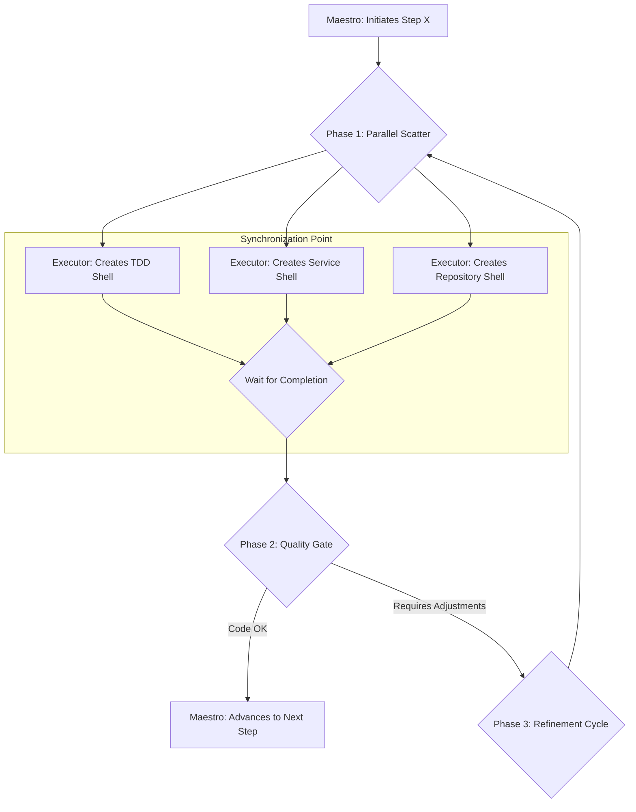

# Agent Evolution and Large-Scale Execution Architecture

**Status:** In Design

## 1. Overview

This document describes a dual-focus agent system architecture, designed to be simultaneously robust, predictable, and adaptive. It combines a **Macro (Top-Down)** orchestration for the controlled execution of plans with a **Micro (Bottom-Up)** evolution mechanism for the continuous improvement and self-organization of agents.

The goal is to create a system that not only executes tasks reliably but also learns and optimizes its own performance over time, inspired by concepts from Game Theory, swarm biology, and economic theory.

## 2. Macro Orchestration: The Top-Down Model

The backbone of the system is a hierarchical and predictable workflow, ensuring that high-level objectives are achieved in a controlled manner.

### 2.1. The Agent Hierarchy

The system operates on three levels of abstraction:

1.  **Level 1: The Strategic Planner (Architect):** In dialogue with a human, this agent explores a problem, refines the scope, and produces a high-level **Master Plan**.
2.  **Level 2: The Maestro (Tactical Project Manager):** This agent receives the Master Plan and breaks it down into a **Playbook** of atomic and sequential execution steps. It manages the flow, validates the quality of each step, and orchestrates the lower-level agents.
3.  **Level 3: The Pool of Specialized Executors:** A set of agents that perform specific tasks. They share a common "Executor" base but are highly specialized through distinct `personas` (e.g., `Executor(persona=TDD_Writer)`, `Executor(persona=Kotlin_Coder)`).

### 2.2. Parallel Execution in Phases

To optimize speed, the Maestro employs a "Parallel Scatter with Synchronization Gate" pattern for each step of the playbook.

1.  **Parallel Scatter:** The Maestro identifies independent tasks within a step (e.g., creating file skeletons) and assigns them to multiple executors simultaneously.
2.  **Synchronization Point:** The Maestro waits for all executors in the current phase to complete their tasks.
3.  **Quality Gate:** The Maestro performs a code review on the consolidated work, deciding whether to advance to the next step or to start a new refinement cycle to correct issues.

## 3. Micro Evolution and Coordination: The Bottom-Up Models

While the Maestro manages the "what," the following models govern the "how" and the evolution of the executor agents' efficiency.

### 3.1. Model A: Trust Signal Market

A coordination model based on economic principles.

*   **Internal Currency:** Each agent has a balance of **"Trust"**.
*   **Investment:** To act, an agent "pays" a cost in Trust, proportional to the risk/impact of the task.
*   **Payoff:** If the action is successful (validated by tests, etc.), the agent receives the investment back plus a "profit." If it fails, it loses the investment.
*   **Emergent Behavior:** Agents with a history of success accumulate Trust and can take on riskier, higher-impact tasks. Agents that fail are naturally marginalized to low-cost tasks until they recover their reputation. Priority is defined by proven competence, not by a central manager.

### 3.2. Model B: Digital Pheromone Orchestration

A coordination model inspired by swarm intelligence.

*   **Shared Environment:** Agents interact with a global "bulletin board," depositing and reading "pheromones" (signals/metadata).
*   **Leaving Signals:** An agent that fixes a bug leaves a `BUG_FIXED` signal. A test agent that fails leaves a `TEST_FAILED` signal.
*   **Reacting to Signals:** An agent's activation rules depend on the signals present. A "Commit Agent" only acts if it sees a `TEST_PASSED` signal and no `TEST_FAILED` signal.
*   **Emergent Behavior:** Efficient workflows emerge as reinforced "pheromone trails." Failure signals act as natural repellents, blocking progress until they are resolved. Coordination is entirely indirect and decentralized.

## 4. Implementation Patterns for Scalability

To make the above models practical and efficient, the following implementation patterns are crucial.

### 4.1. The Two-Layer Agent (Trigger and Reasoning Pattern)

Solves the cost and efficiency problem of unnecessarily invoking LLMs. Each agent is divided into:

*   **Layer 1 (Trigger):** A lightweight, fast, non-AI script that checks activation conditions each cycle (e.g., "Is the Trust balance sufficient?" or "Are the correct pheromones present?").
*   **Layer 2 (Reasoner):** The full agent with an LLM, which is only activated if the Trigger returns "YES." This ensures that expensive AI firepower is used only when there is relevant work to be done.

### 4.2. Ephemeral Workspaces per Container

Ensures total isolation for the execution of parallel plans.

*   **Flow:** For each plan, a new Docker container is started. The first step is a `git clone` of the project, creating a fully isolated workspace. The work is executed inside the container, and at the end, a `git push` synchronizes the result. The container is then destroyed.
*   **Benefit:** Eliminates any possibility of interference between concurrent plans.

### 4.3. Persistence Abstraction (Pluggable State Repository)

Meets the dual need for simplicity in development and robustness for scale.

*   **The Contract:** The system operates against an `IStateRepository` interface.
*   **The Implementations:**
    1.  **`FileSystemStateRepository`:** The default implementation. Saves state in local `.json` files. Ideal for development and testing, as it requires no external dependencies.
    2.  **`MongoStateRepository`:** An alternative implementation that saves the state in an external database. Essential for the ephemeral container model, ensuring that the plan's state survives the container's destruction and allowing the resumption of interrupted flows.