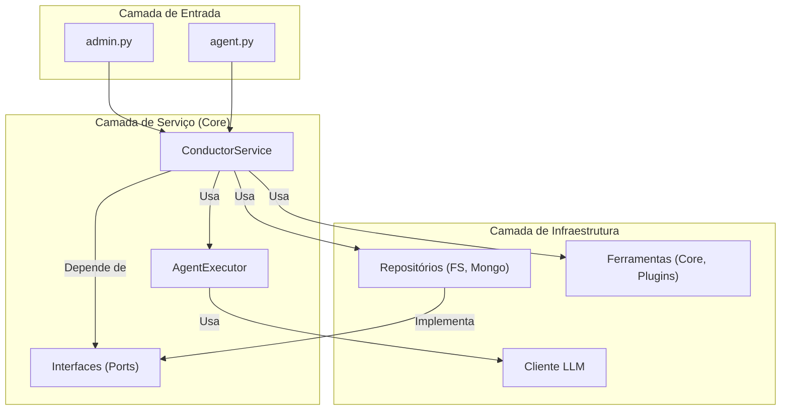

# Especificação Técnica e Plano de Execução: 0032-atualizar-docs-arquitetura

#### **1. CONTEXTO OPERACIONAL**
Internalize sua persona e modo de operação. Você é um arquiteto de software encarregado de documentar o novo design do sistema.

#### **2. OBJETIVO ESTRATÉGICO (O "PORQUÊ")**
Esta tarefa garante que a documentação de design do projeto seja uma representação fiel da base de código atual. Manter a documentação de arquitetura sincronizada com a implementação é vital para a saúde a longo prazo do projeto, facilitando o onboarding e a tomada de decisões técnicas futuras.

#### **3. RESTRIÇÕES ARQUITETÔNICAS (REQUISITOS NÃO FUNCIONAIS)**
- **Precisão:** A nova documentação **DEVE** descrever com precisão o papel do `ConductorService`, `AgentExecutor`, das interfaces em `ports` e do fluxo de configuração via `config.yaml`.
- **Clareza:** A documentação **DEVE** usar diagramas (em formato Mermaid.js) para ilustrar o novo fluxo de dados e a hierarquia de componentes.
- **Consolidação:** Um novo documento, `UNIFIED_ARCHITECTURE.md`, **DEVE** ser criado para servir como a fonte da verdade definitiva para a nova arquitetura.

#### **4. ESPECIFICAÇÃO TÉCNICA (O "O QUÊ" E "COMO")**
Você deve criar um novo documento e revisar os existentes. A principal tarefa é a criação do novo documento consolidado.

**Arquivo 1 (Novo): `docs/architecture/UNIFIED_ARCHITECTURE.md`**
```markdown
# A Arquitetura Unificada do Conductor (Pós-SAGA-017)

## 1. Visão Geral

A arquitetura do Conductor evoluiu para um modelo desacoplado e orientado a serviços. O objetivo é separar claramente as responsabilidades, permitindo extensibilidade, testabilidade e escalabilidade. A filosofia central é a Inversão de Dependência, onde os componentes de alto nível não dependem dos detalhes dos componentes de baixo nível.

## 2. Componentes Principais

A arquitetura é dividida em três camadas lógicas principais:

-   **Camada de Entrada (Interface):** Pontos de entrada do usuário.
-   **Camada de Serviço (Core):** O cérebro da aplicação.
-   **Camada de Infraestrutura:** Implementações concretas de dependências externas.

### Diagrama de Componentes



## 3. Fluxo de Execução de uma Tarefa

1.  Um **CLI** (`admin.py` ou `agent.py`) recebe um comando do usuário.
2.  Ele traduz os argumentos em um `TaskDTO` e chama `execute_task` no **ConductorService**.
3.  O **ConductorService** consulta o **Repositório** para obter a definição do agente.
4.  Ele carrega as **Ferramentas** permitidas.
5.  Ele instancia um **AgentExecutor**, injetando o cliente **LLM**, as ferramentas e outras dependências.
6.  O **AgentExecutor** executa a tarefa, interagindo com o **LLM**.
7.  O resultado é retornado como um `TaskResultDTO` através das camadas.
```

**Passo 2: Revisar e Atualizar Outros Documentos**
Revise outros arquivos em `docs/architecture/` e substitua descrições da arquitetura antiga por links para o novo `UNIFIED_ARCHITECTURE.md`.

#### **5. CRITÉRIOS DE ACEITAÇÃO**
Seu trabalho estará concluído quando o novo arquivo `UNIFIED_ARCHITECTURE.md` for criado com o conteúdo especificado e outros documentos na pasta forem revisados para apontar para ele.

#### **6. SINAL DE CONCLUSÃO**
Responda com: `TASK_COMPLETE`
